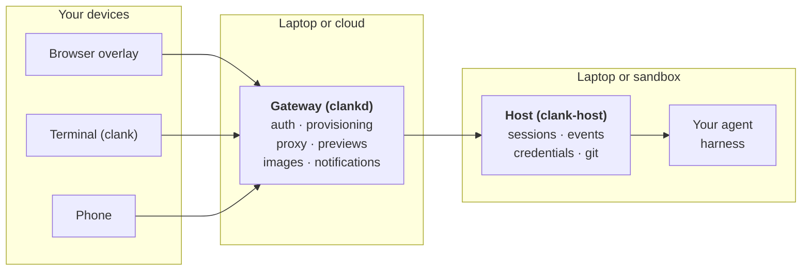

# Clank

## Visually editable previews for web & mobile

Clank injects an overlay into your web or mobile apps that allows you to edit them while you're using them.

The fastest way to iterate on apps is by just pointing and explaining. 

Clank is for iterating on that last 10% that AI can't solve.

Run `clank preview` to start your dev server with the clank overlay and connect to your agent of choice: Claude Code, OpenCode, and Codex (with Gemini, Hermes, and Pi support coming soon).

- Phone + Expo app: Opens native app with agent overlay* (like Expo Go)
- Phone + web app: Opens webview with agent overlay*
- Laptop + web app: Opens browser with agent overlay
- Laptop + Expo app: No preview yet, but dev server presents QR code for mobile app to scan.

Live AI edits with hot module reloading.

[*] The phone needs a clank gateway. Either connect to your laptop via `clank pair`, or a hosted cloud solution like [supaclank.com](https://supaclank.com) to build without a laptop.

## Get started

```
brew install supaclank/tap/clank
clank preview
```

| Key | Action |
|-----|--------|
| <kbd>⌘E</kbd> / <kbd>Ctrl+E</kbd> | summon / hide the prompt box |
| hold <kbd>⌘</kbd> / <kbd>⌃</kbd> | point at elements to attach them as context |
| <kbd>⇪ Caps Lock</kbd> | tap to talk, tap again to transcribe |
| hold <kbd>⇧</kbd> | prompt box snaps to the cursor |

For the mobile overlay: Shake the phone to bring up the floating prompt box, shake again to see chat. The app remains usable. Just move the box around, or hide it.

## Architecture



On a laptop everything runs locally, using your existing agent and git setup. The laptop is your default "sandbox" environment, more info in [provisioning & sandboxes](#provisioning--sandboxes).

A multi-tenant gateway that's built to be a dumb relay with minimal user data stored. It provisions sandboxes for the user, authenticates and proxies requests, handles wake/sleep, and some coordination like notifications, images, previews.

The host handles the coding agents, git operations, credentials, keepalive, webhooks. It connects to the agent harnesses via [ACP](https://agentclientprotocol.com), and needs a persistent dev environment where credentials and all the work is stored, whether it be your laptop or a persistent sandbox.

### Gateway
#### Multi-tenant
The gateway routes requests by user ID, which it acquires via a simple `pkg/auth.Authenticator` interface.

```go
type Authenticator interface {
    Verify(r *http.Request) (Principal, error)
}

type Principal struct {
    UserID string
    Claims map[string]any
}
```
This allows the gateway to remain agnostic to your specific auth method. 

The only contract is that the request context contains that auth.Principal after verification. Clank provides a simple middleware for that, calling Authenticator's Verify(r) and injecting the principal. Clank also bundles four Authenticators into the auth package: [AllowAll, OIDC, StaticBearer, JWTHS256](https://github.com/supaclank/clank/blob/main/pkg/auth/auth.go#L7-L12).

#### Bridge auth
Clank CLI itself implements a mobile<->laptop bridge auth.Authenticator, allowing you to pair your mobile app to your laptop and control your agents from the phone. 

Most services today require a central server to mediate this pairing. Clank instead implemented a protocol for this.

For the implementation and spec for this, see [docs/bridge-pairing.md](https://github.com/supaclank/clank/blob/main/docs/bridge-pairing.md). 

<details>
<summary><b>TL;DR</b></summary>
Mobile and laptop exchange their public keys and ensure there was no man-in-the-middle tampering, but they do not encrypt traffic to prevent eavesdropping. No secrets are transmitted over the wire. Encryption is left for your network transport to solve, by e.g. using Tailscale. The protocol is secured by entering a code displayed on the phone using the laptop keyboard, proving access to both devices and the intent to pair them. After pairing, the phone signs each control request, and the laptop accepts requests only from enrolled device keys.
</details>

#### Provisioning & sandboxes
Clank tries to be agnostic to the exact sandbox provider. Each sandbox provider implements a `Provisioner` interface. The laptop implements a local.Provisioner, and the cloud currently uses flymachine.Provisioner (you own the image, we just require `clank-host` to be reachable).

<details>
<summary><b>Why?</b></summary>
<b>Persistent sandboxes</b>

The philosophy: Agents should have access to a full development environment and the context for several projects over time. This is needed for a cloud agent that proactively prioritizes and does work, where you just steer and verify the work.

An ephemeral sandbox becomes a persistent sandbox by mounting volumes that persist the disk state. Different sandbox providers work in different ways, either they have a snapshot API where you have to manage the snapshots yourself, or they do it for you. This is connected to auto-sleeping: Does the provider automatically snapshot disk and shut down? When does that trigger? No running processes? No open TCP connections? A hardcoded timeout? Heartbeat based timeout where you have to call an external API? 

All of this requires a lot of complexity on the backend to do reliably because the risk of getting it wrong means:
- Interrupting the user workflow at the wrong time
- Letting sandboxes run 24/7 incurring extra cost.

The `Provisioner` interface abstracts this away from the gateway. Each implementation is different.

This is also set up well for a future where you spin up lightweight microVMs on your own laptop.

> note: Clank originally started with Daytona, moved to Fly.io's Sprites, and then migrated to Fly.io Machines. Throughout this the interface hardened, but currently the exact interface is subject to change, since we haven't actually battle-tested it against multiple sandbox providers yet.

</details>

### End-to-end encryption
<b>TL;DR</b>: Not implemented. Self-hosting is the solution: Users can instead pair their laptop and use something like Tailscale. Companies can self-host on their own infra.

<details>
<summary><b>Why?</b></summary>
In a multi-tenant environment, having access to every sandbox is a liability. But it's also unavoidable, because you have to provision the machines somehow and you can't really give the keys to your users without also keeping your master key (at least no compute provider allows this).

That said, there is no central database for user session data or code. All of that is handled by the sandbox which you already trust with your credentials. You would have to SSH to each individual sandbox to acquire this data.
</details>


### Agent harnesses
Clank supports Claude Code, Codex, OpenCode, via ACP. We're probably adding support for Hermes, Gemini, and Pi soon. We still need small adapters for each ACP server, due to versioning, auth, and slight differences.

### Previews
Expo projects are detected automatically. For web projects, your connected agent generates .`clank/launch.yaml` on first run. 

For web, `clank preview` starts or attaches to a dev server and injects the Clank overlay as a \<script\> tag without changing your source code.

For Expo, `clank preview` injects a small script that hooks into various React Native APIs.

Local previews stay on your laptop, while hosted previews use an owner-only URL that securely tunnels through the gateway and can be shared or revoked. Easy public tunnel links for your local previews coming soon

The mobile app itself is similar to how Expo Go works under the hood. It loads user apps using the same pre-installed native components that Expo Go has, so Clank and Expo Go apps are compatible. Support for development builds is on the roadmap.

For Expo apps we also append a system prompt, to avoid common pitfalls that agents seem to fall into when developing mobile apps: https://github.com/supaclank/clank/tree/main/internal/agent/guidance.

### Voice
Voice is push-to-talk dictation for the preview overlay. Use the browser's Web Speech API or keep audio local with `clank-voice`, powered by Silero VAD and NVIDIA Parakeet v3. The mobile app runs the same speech-recognition stack on-device.

### Images & attachments
Images and attachments are handled via a minimal blobstore interface, with S3 for cloud deployments, and a LAN one for mobile->laptop transfers.

## Roadmap
- In the future we may use something like https://github.com/superfly/tokenizer (and/or an LLM proxy) for people that don't want to give up real keys, and for 3rd party connections.
- Ephemeral one-off sandboxes are also on the roadmap for workflows that need the isolation.
- Public tunnel links for your local previews
- Support for development builds

## Docs

- [docs/chat-client-spec](docs/chat-client-spec/README.md). The spec every clank client is built against (the TUI is the golden reference; the mobile app tracks it too).
- [docs/bridge-pairing.md](docs/bridge-pairing.md). The phone↔laptop pairing protocol
- [docker/README.md](docker/README.md). Self-hosted gateway stack
- [voice-engine/README.md](voice-engine/README.md). The local dictation engine.
